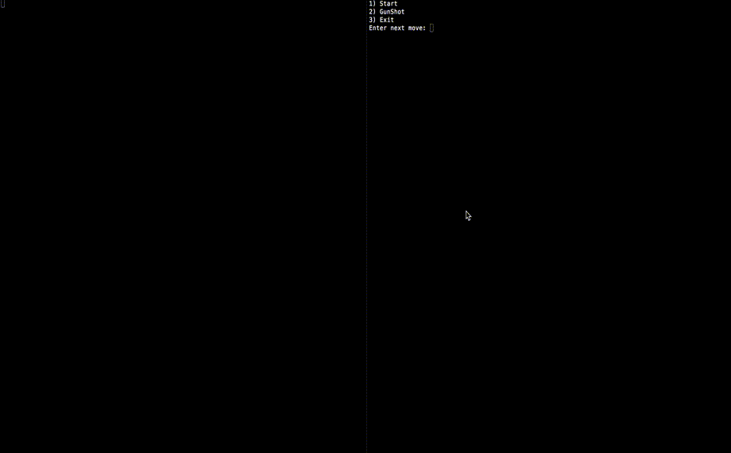

# Go Battleship

A Go battleship implementation with client-server support over network (net/http) - 1 to PC.

## Demo

A Demo of what the Game is like if called - a sort of battleship-cli beta.



## Idea

The battleship game has always fascinated me: I first wrote a Java version of battleship during my course of Programming II. I always thought battleship (running in a shell env) is a good exercise to start handle string format, base structs and so on. Then I realized than battleship game itself could be so much more. In recent month I started "Going" (:P) so I will use this readme for both collect some ideas and describe what I've planned right now.

## The game

The base game is famous and simple: two seas, some ships, with different dimensions, and shots that alternate while time lapse. I started defining a generic model that could be use to play with a machine or with another client. In next paragraph I will describe actual structs and idea behind the core.

### Struct

[[1] Game](#game)

[[2] Player](#player)

[[3] Sea](#sea)

[[4] Ship](#shipcoordinates)

[[5] Coordinates](#shipcoordinates)

#### <a name="game"></a>Game

The ```Game``` represents the ```Sea```. Just kidding: obviously it reprents the entire Game. Yes, you read correctly: the entire game is wrappred around a struct. This is to satisfy constraints that future version of game will impose. At the moment, in a Game two Player are defined. The first player is what I refer to in the code as the caller: in fact when a client create a Game, the entire Game travel over the network from client to server and then back to client. I create a swtich of perspective that switch the pointer in Game struct, to better define unique signature that modify Game struct from the "caller" point of view. To be defined yet:

- Difficulty: this will probably be a int field in Game struct, to define a strategy used by PC to shot the opponent (single client). I already defined the logic behind different difficulty, but I haven't implemented it yet.
- Time: this will be a counter. I need to think a little bit more about that: I don't know if it's a better idea defining a simulated discrete time with an always growing counter, or bind time-dependent features of entire game to PC current time (unix timestamp).

#### <a name="player"></a>Player

A ```Player``` is defined with a name, a ```Sea``` (with only ships he owns), a (decreasing) number of shot (gunshot), a list of ```Coordinates``` with moves suffered (moves that opponent has done in the Sea). 
__Note__: 1) in the future, different type of shots will have different cost and several consequences in the opponent's sea. At the moment, only a simple old style GunShot is implemented. 2) The suffered moves of opponent described the moves done by the caller (focused Player). This will of course change in future version of game, because in a generic multiplayer view of the Game we need to unbind Player => eventually we can bind each Coordinates to the Player.

#### <a name="sea"></a>Sea

A ```Sea``` is defined as n*n Matrix. The matrix is not defined because I realized I don't need a matrix to create logic. I only need coordinates and virtual dimension of Sea. __Note__: different topology with different dimension will be available in future. Wind and time will intercat with Ships in the Sea, moving them according to some sort of rules (I thought about cellular automata :P ).

#### <a name="shipcoordinates"></a>Ships & Coordinates

A ```Ship``` has a dimension (n) and a list of ```Coordinates``` that occupies. Each ```Coordinates``` has a dual-dimension couple of int that represents position in the Sea and a Status. At the moment, possible status of a Coordinates are defined in ```const``` and listed below:

- STATUS\_SHIP\_OK
- STATUS\_SHIP\_STRICKEN
- STATUS\_SHIP\_BURNING
- STATUS\_SHIP\_DESTROYED

- STATUS\_SEA\_OK
- STATUS\_SEA\_STRICKEN

The logic behind is ```STATUS\_[INVOLVED\_OBJECT]\_[BRIEF\_WORD\_DESCRIBING\_STATUS]```. __Note__: at the moment, I don't destroy ship when all the positions have been stricken => this is a needed step because it says to us when the Game is finished.

